# SQL TASK

This SQL task covers fundamental to advanced operations, including SELECT queries, filtering, sorting, JOINs, handling NULLs, expressions, aggregates, and table operations like inserting, updating, and deleting rows and tables. The provided solutions offer practical examples for mastering these queries and concepts.

---

## Screenshots

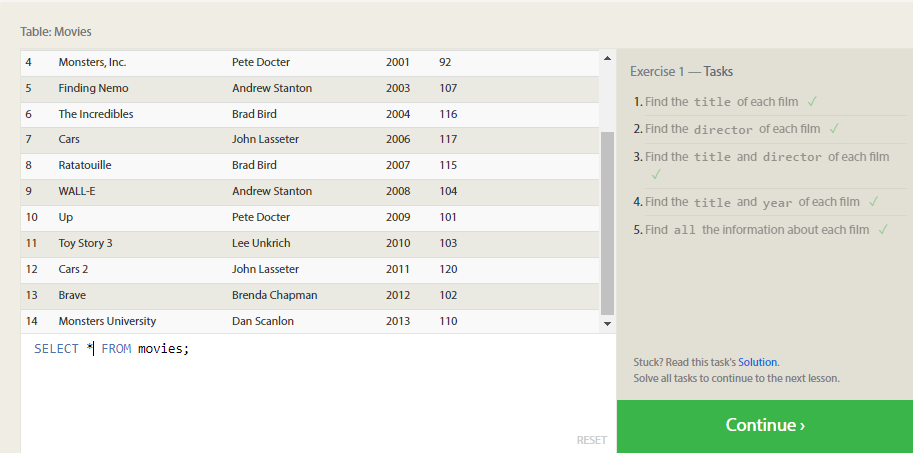
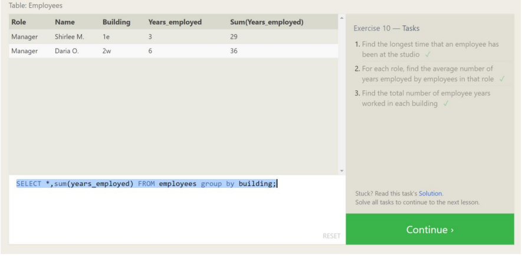
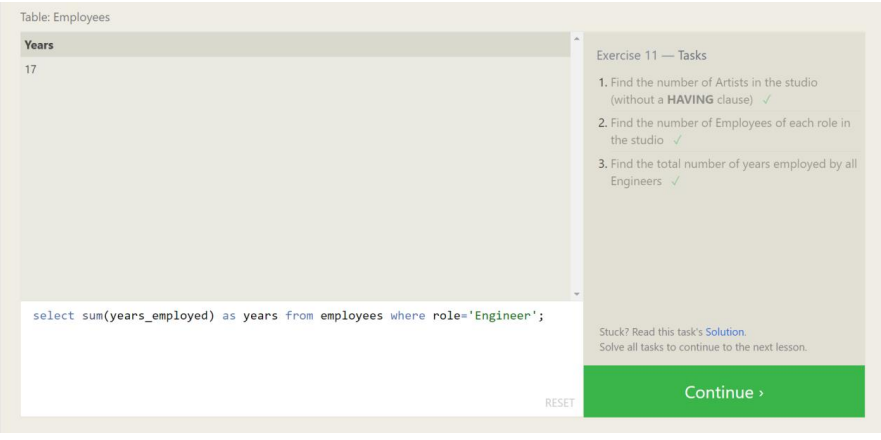
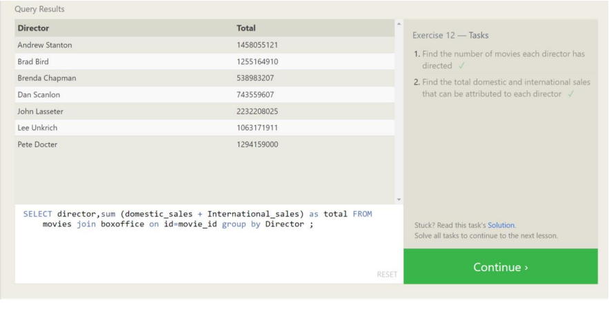
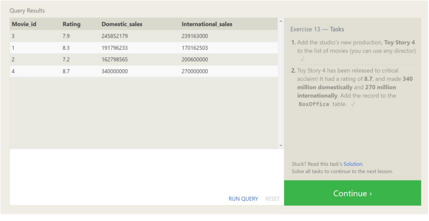
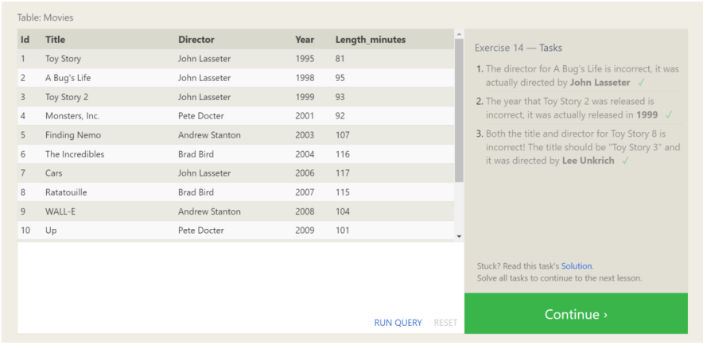
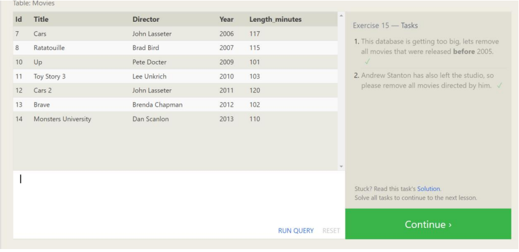
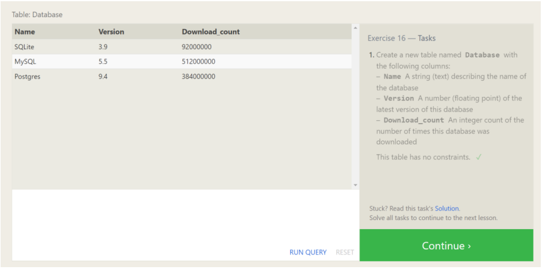
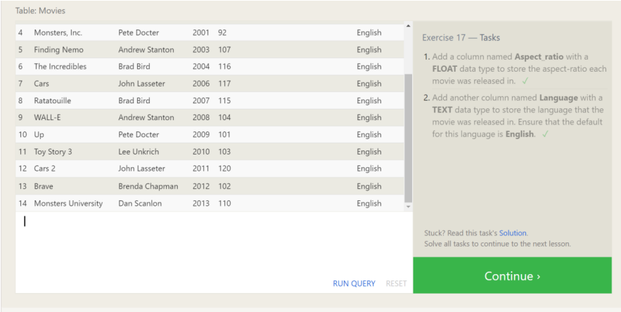
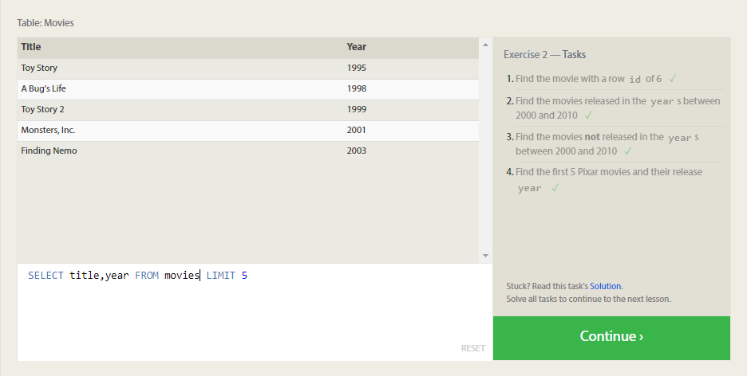
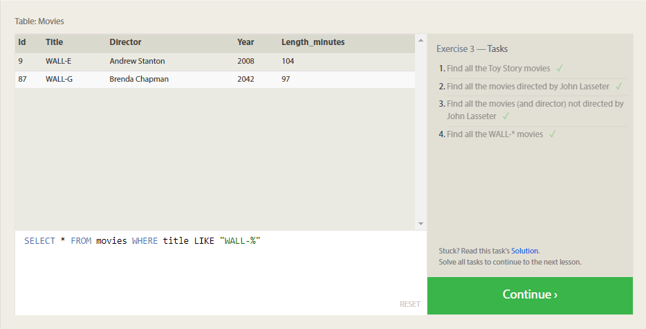
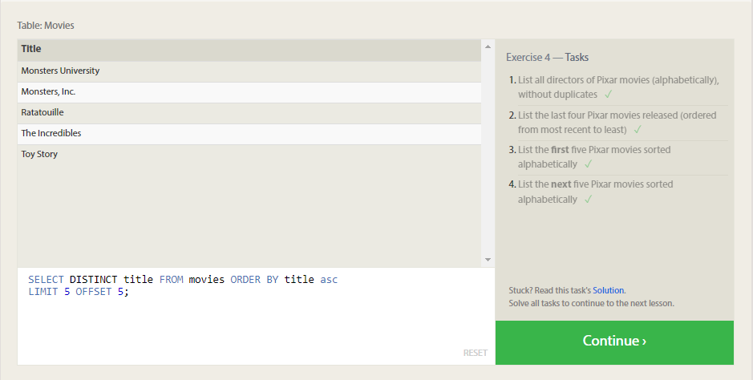
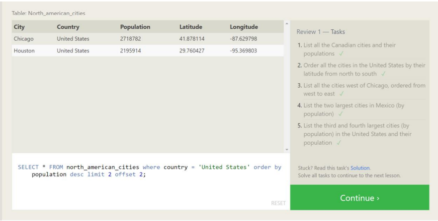
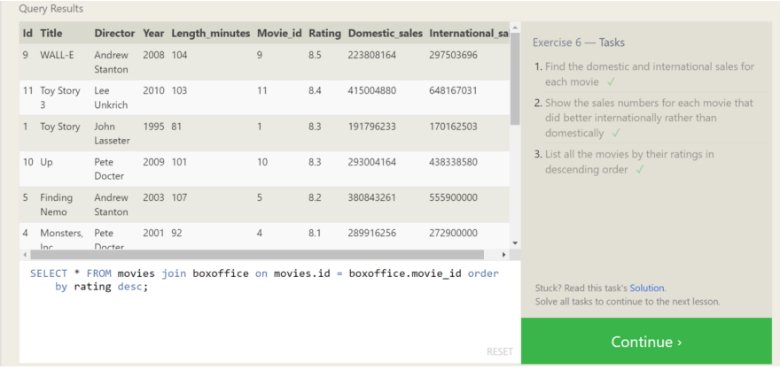
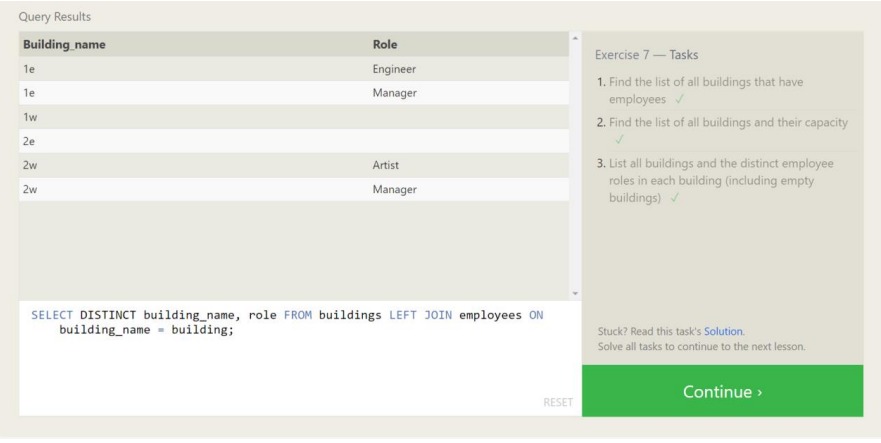
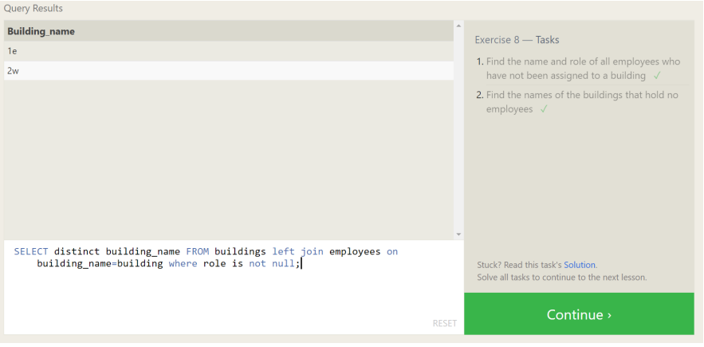
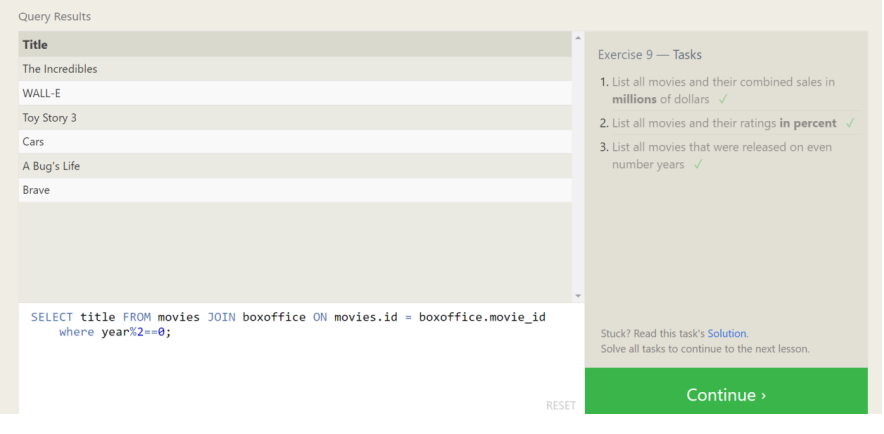

---

## Acknowledgement

- [sqlbolt](https://sqlbolt.com/) - The task is done using sqlbolt

---
